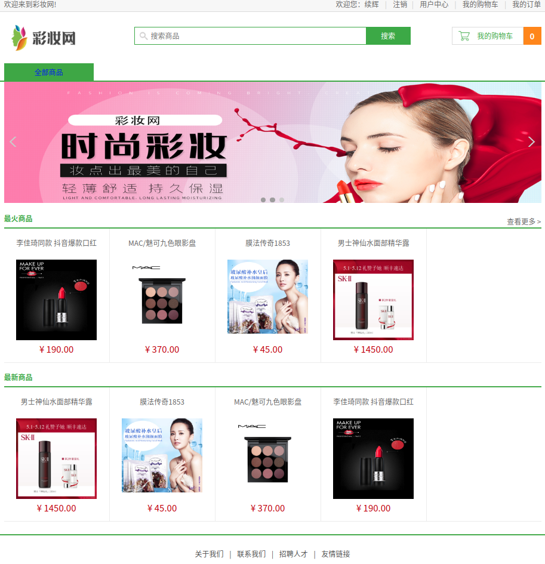

## 基于Django开发的线上化妆品商城

预览地址：[点击这里](http://122.112.231.109:8000/)

## 开发环境

    python3.7
## 依赖环境
```python
pip install -r requirements.txt
```

安装 DjangoUeditor3（百度的富文本编辑器）

下载
    https://github.com/twz915/DjangoUeditor3
    (已经下载到项目根目录DjangoUeditor3-master.zip)
安装   

```python
pip install DjangoUeditor3-master.zip
```

## 配置数据库为Mysql

```python
# settings.py

找到配置信息

DATABASES = {
    'default': {
        'ENGINE': 'django.db.backends.mysql',
        'NAME': '数据库名字',
        'USER': '数据库用户名',
        'PASSWORD': '数据库密码',
        'HOST': '127.0.0.1',
        'PORT': '3306',
    }
}
```
## 迁移数据库

>```python
>python manage.py makemigrations
>python manage.py migrate
>```
>
># 创建管理员
>
>```python
>python manage.py createsuperuser
>```

## 运行

```python
python manage.py runserver
```

## 中途可能遇到的问题

  File "。。。。/book_shop/venv/lib/python3.7/site-packages/django/forms/boundfield.py", line 93, in as_widget
    renderer=self.form.renderer,
TypeError: render() got an unexpected keyword argument 'renderer'

注释掉报错的代码即可

## 项目截图

